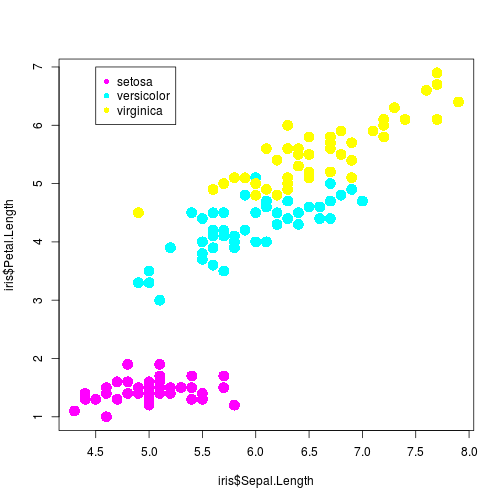

---
title       : ShinyApp - IRIS Dataset
subtitle    : Course Project - Shiny Application and Reproducible Pitch
author      : LKNGIN
job         : 2016
framework   : io2012        # {io2012, html5slides, shower, dzslides, ...}
highlighter : highlight.js  # {highlight.js, prettify, highlight}
hitheme     : tomorrow      # 
widgets     : []            # {mathjax, quiz, bootstrap}
mode        : selfcontained # {standalone, draft}
knit        : slidify::knit2slides
--- .class #id 
## Overview

This application was built as per the requirements stated in the course assignment **Developing Data Products - Your Reproducible Pitch Presentation**

The first part of the assignment, **Your Shiny Application**, is avalilable at:
https://buzzmapper.shinyapps.io/Shinyapps/

Source code for ui.R and server.R files are available on the GitHub repo:
https://github.com/lkngin/Coursera.git

--- .class #id 
## Web Application functionality
The Web Application is reactive and is a useful tool to explore the Iris dataset.

User can select one of the 4 variables, Sepal.Length, Sepal.Width, Petal.Length, Petal.Width, to be shown in the graph interactively.

The user can also select the colour to be plotted for the Histogram.

--- .class #id 
## IRIS Dataset

The data used in the app comes from the (iris) dataset. 
iris dataset summary:

```
##   Sepal.Length    Sepal.Width     Petal.Length    Petal.Width   
##  Min.   :4.300   Min.   :2.000   Min.   :1.000   Min.   :0.100  
##  1st Qu.:5.100   1st Qu.:2.800   1st Qu.:1.600   1st Qu.:0.300  
##  Median :5.800   Median :3.000   Median :4.350   Median :1.300  
##  Mean   :5.843   Mean   :3.057   Mean   :3.758   Mean   :1.199  
##  3rd Qu.:6.400   3rd Qu.:3.300   3rd Qu.:5.100   3rd Qu.:1.800  
##  Max.   :7.900   Max.   :4.400   Max.   :6.900   Max.   :2.500  
##        Species  
##  setosa    :50  
##  versicolor:50  
##  virginica :50  
##                 
##                 
## 
```

--- .class #id 
## Plot


